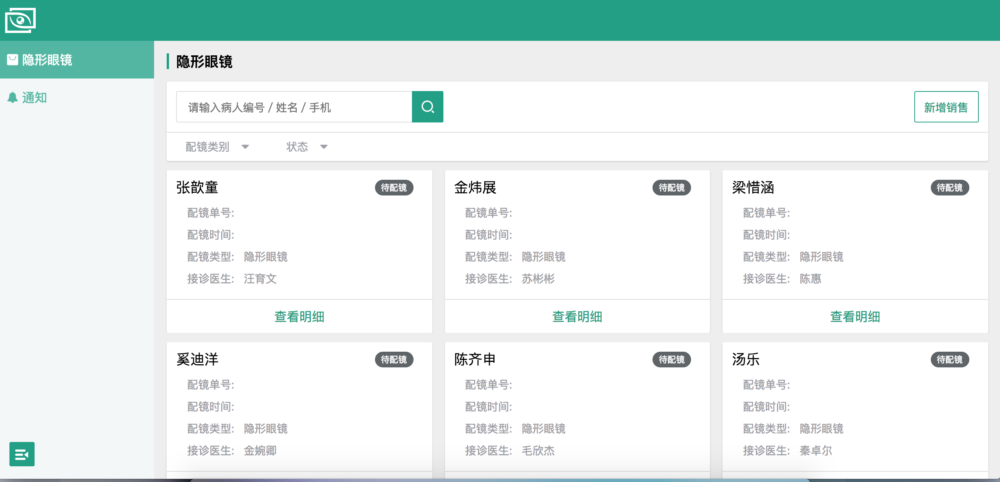
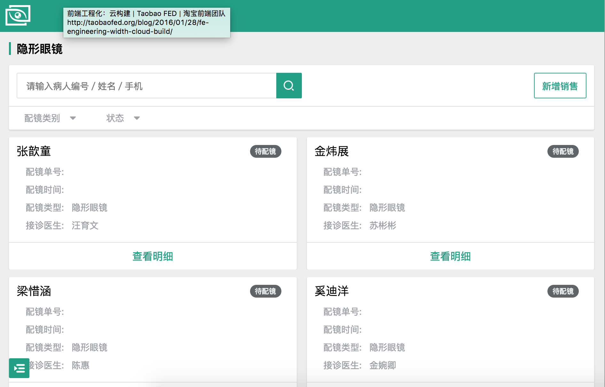
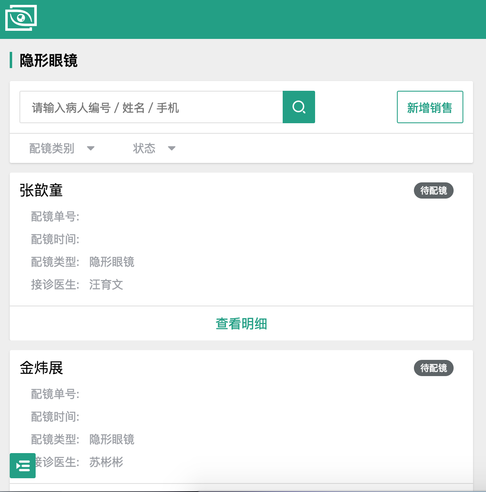

### 1 基本概念

在讨论方案的时候，先明确几个概念：

#### 1.1视窗 viewport

桌面浏览器中 viewport 严格等于浏览器的窗口，它的作用是给 CSS 布局限制一个最大宽度，viewport 的宽度和浏览器窗口的宽度一致。

但在移动设备上有点复杂，为更好的为 CSS 布局服务，提供了两个 viewport ：**Visual Viewport **、**Layout Viewport** 。浏览器为让用户在小屏下网页也能显示的很好，所以把宽度设置的很大，一般在 768px～1024px 。可以通过 `<meta>` 设置 LayoutViewport 的宽度：

```html
<meta name="viewport" content="width=640">
```

媒体查询的尺寸指的是 LayoutViewport。`document.documentElement.clientWidth/Height ` 返回 LayoutViewport 的尺寸。

#### 1.2 物理像素（Physical Pixel）

物理像素又被称为设备像素，是显示设备中最微小的物理部件。一般所说的分辨率指的是物理像素。

#### 1.3 设备独立像素（Density-Independent Pixel）

可以认为是计算机坐标系统中的一个点，这个点代表一个可以由程序使用的虚拟像素，如 CSS像素，然后由相关系统转换为物理像素。

#### 1.4 CSS像素

CSS像素是一个抽象的单位，主要是用在浏览器上，度量 Web 页面的内容，称为设备独立像素。CSS 像素相当于多少设备像素取决于两个条件：

- 页面是否缩放
- 屏幕是否为高密度

#### 1.5 单位英寸像素数（Pixel Per Inch，PPI）

现实世界的一英寸内像素数，决定了屏幕的显示质量。

#### 1.6 设备像素比率（Device Pixel Ratio，DPR）

物理像素与逻辑像素的对应关系。

```
设备像素比 = 物理像素 / 设备独立像素
```

### 2 适配方案

结合过往的经验，总结了下包括移动端、PC端适配的方案，大致有如下实现方式：

1. 媒体查询：CSS3 的 `media`
2. `flex` 弹性布局
3. 以手淘为代表的 `rem` + `viewport` 实现
4. `rem` 的方式

#### 2.1 媒体查询

> 一个响应式网页由三部分组成：一个灵活的布局、灵活的图片和媒体、以及媒体查询

主要是通过媒体查询设备的宽度来执行不同的 `CSS` 代码，最终达到界面的配置。

优点：

1. `media query` 可以做到设备像素比的判断，方法简单，**Bootstrap** 等框架使用这种布局实现响应式布局；
2. 调整屏幕时不用刷新界面即可响应式展示；
3. 便于修改，只需修改 `CSS` 文件。

缺点：

1. 代码量较大；
2. 兼顾大屏幕或高清设备，造成资源浪费；
3. 兼顾移动端和 PC端响应式展示效果，损失各自特有的交互方式。

#### 2.2 flex 弹性布局

设置固定的 `viewport`，固定高度，宽度自适应，元素采用 `px` 做单位。

```html
<meta name="viewport" content="width=device-width,initial-scale=1,maximum-scale=1,user-scalable=no">
```

随着屏幕的变化，页面也会跟着变化，效果和 PC页面堵流体布局差不多。

#### 2.3. Flexible

手淘使用 Flexible 实现H5页面的终端适配，基本思路如下：

1. 选择一种尺寸作为设计和开发的基准；
2. 定义一套适配规则，自动适配剩下的尺寸；
3. 特殊适配效果给出设计效果。

Flexible 会根据不同的设备在 `<html>` 元素上增加不同的 `data-dpr` 属性以及 `font-size` 样式。设置 `<meta> `标签使得页面的宽度为渲染像素尺寸。页面中的元素通过 `rem` 单位来设置，根据 `<html>`  元素的 `font-size` 值做计算，从而实现屏幕的适配效果。

文本字号不建议是用 `rem` ，在 Flexible 整个适配方案中，考虑文本还是使用 `px` 作为单位，通过使用 `data-dpr` 属性区分不同 `dpr` 下单文本字号大小：

```
div {
    width: 1rem;
    height: 0.4rem;
    font-size: 12px; // 默认写上dpr为1的fontSize
}
[data-dpr="2"] div {
    font-size: 24px;
}
[data-dpr="3"] div {
    font-size: 36px;
}
```

该方案实现仅适合手机端，手淘也仅考虑了手机端的适配情况，大于 540px 的屏幕固定内容区域为 540px，两边留白。但该方案的思路值得学习，想让元素适配的时候就用 `rem`，想让文字不缩放的时候就用 `px`，比较灵活。

现考虑到 pad 端设备尺寸相差较大，期望大屏幕能够显示更多的内容，充分利用大屏的优势，我们的项目不完全使用该方案。

#### 2.4 固定宽度，viewport 缩放

设计图、页面宽度、viewport width 使用一个同一个宽度，单位使用 `px`，浏览器完成缩放。

与 Flexible 实现效果一致，通过在不同屏幕上缩放来实现适配。

#### 2.5 vw、vh

### 3 主流 pad 设备

以 iPad 为主，展示了部分设备的分辨率、设备独立像素等信息。


| Tablet                  | Platform | Width × Height(dp) | Width × Height(px) | Density |
| ----------------------- | :------- | ------------------ | ------------------ | ------- |
| iPad                    | iOS      | 768 × 1024         | 768 × 1024         | 1.0     |
| iPad Mini               | iOS      | 768 × 1024         | 768 × 1024         | 1.0     |
| iPad Mini Retina        | iOS      | 768 × 1024         | 1536 × 2048        | 2.0     |
| iPad Pro                | iOS      | 1366  × 1024       | 2732 × 2048        | 2.0     |
| iPad Retina             | iOS      | 768 × 1024         | 1536 × 2048        | 2.0     |
| Microsoft Surface Pro 4 | Windows  | 1368 × 912         | 2736 × 1824        | 2.0     |
| Samsung Galaxy Tab 10   | Android  | 800 × 1200         | 2048 × 1536        | 1.0     |


### 4 适配方案

本次考虑的是 pad 端适配，过程中权衡各个分辨率下页面布局的情况以及最终编译文件大小，做出了一些取舍。

#### 4.1 设置 viewport 为设备尺寸

```
<meta name="viewport" content="width=device-width, initial-scale=1, user-scalable=no">
```

#### 4.2 媒体查询布局

界面布局上根据 bootstrap 定义的不同设备分辨率，现考虑针对 **小于 768px**、**大于768px且小于992px**、**大于992px**的屏幕做不同处理。

```
/* 超小屏幕（手机，小于 768px） */
/* 移动设备有限，逐级增加样式 */

/* 小屏幕（平板，大于等于 768px） */
@media (min-width: @screen-sm-min) { ... }

/* 中等屏幕（桌面显示器，大于等于 992px） */
@media (min-width: @screen-md-min) { ... }

/* 大屏幕（大桌面显示器，大于等于 1200px） */
/* 权衡到 pad端主流使用屏幕不会太大，且减少代码量，考虑将 1200px 与 992px 合并适配 */
@media (min-width: @screen-lg-min) { ... }
```

实现效果如下：







#### 4.2 rem

针对不同分辨率、dpr下要适配的元素，使用 rem 进行灵活的适配。


### 5 兼容

考虑适配兼容性良好的版本。

1. Chrome 49 及以上
2. Firefox 55及以上
3. Safari 10.1及以上
4. UC Browser

### 6 参考文献：

适配方案：

[使用Flexible实现手淘H5页面的终端适配][lib-flexible-for-html5-layout]

[移动端适配方案(上) ][mobile-1]

[移动端适配方案(下) ][mobile-2]

[手机淘宝的flexible设计与实现][mobile-flexible]

[hotcss][hotcss]

分辨率及使用情况数据统计网站：

[Material Design][material]

[DPI Calculator /PPI Calculator][dpi-calculator]

[screensize][screensize]

尺寸、像素相关知识：

[The Ultimate Guide To iPhone Resolutions][iPhone-resolutions]


[lib-flexible-for-html5-layout]: https://www.w3cplus.com/mobile/lib-flexible-for-html5-layout.html
[material]: https://material.io/devices/
[dpi-calculator]: https://www.sven.de/dpi/
[screensize]: http://screensiz.es/
[mobile-1]: https://github.com/riskers/blog/issues/17
[mobile-2]: https://github.com/riskers/blog/issues/18
[mobile-flexible]: https://icewing.cc/post/taobao-mobile-flexible.html
[iPhone-resolutions]: https://www.paintcodeapp.com/news/ultimate-guide-to-iphone-resolutions
[hotcss]: https://github.com/imochen/hotcss
